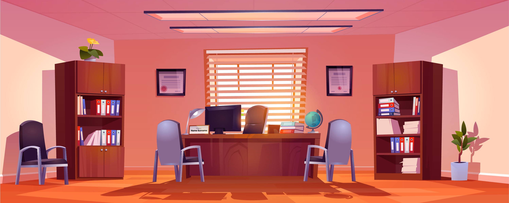

# Sommaire

### Godot

- [Qu'est-ce que Godot](#godot-about)
- [Système de scènes et de noeuds](#godot-nodes)
- [Scripts](#godot-scripts)
- [Aperçu Editeur](#godot-editor)
- [Télécharger Godot](#godot-download)
- [Comment importer le projet](#godot-import-game)
- [Comment exporter le projet](#godot-export-game)

### Whiskers (éditeur de dialogues)

- [Qu'est-ce que Whiskers]
- [Les noeuds Whiskers]
- [Parcours du graphe]
- [Notes importantes]

### Serious Game

- [Visuels]
- [Bâtiments]
- [Evénements scénaristiques]

[Qu'est-ce que Godot]: /documentation/godot.md
[Système de scènes et de noeuds]: /documentation/godot.md
[Scripts]: /documentation/godot.md
[Aperçu Editeur]: /documentation/godot.md
[Télécharger Godot]: /documentation/godot.md
[Comment importer le projet]: /documentation/godot.md
[Comment exporter le projet]: /documentation/godot.md

[Qu'est-ce que Whiskers]: <>
[Les noeuds Whiskers]: <>
[Parcours du graphe]: <>
[Notes importantes]: <>

[Visuels]: <>
[Bâtiments]: <>
[Evénements scénaristiques]: <>
