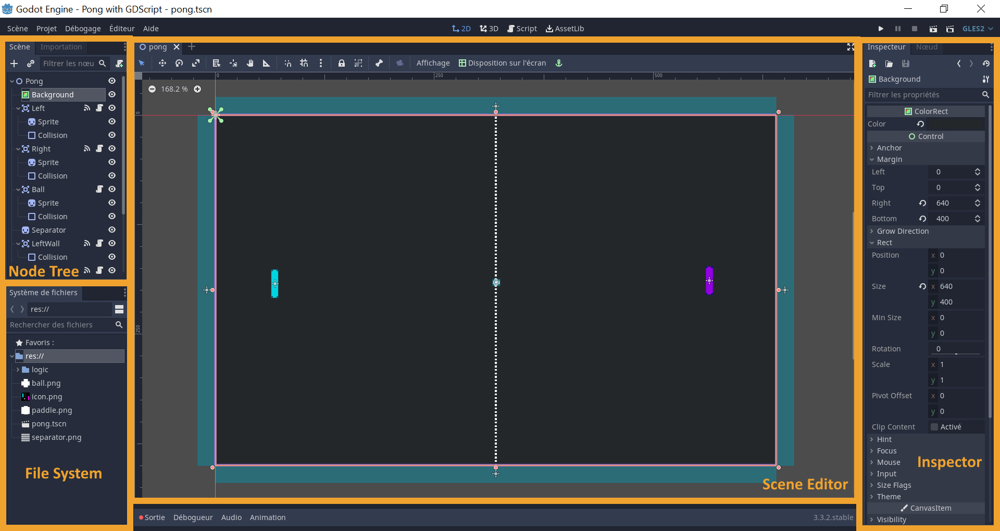

[Retourner au Sommaire]: ../README.md

[Retourner au Sommaire]

### Liens Godot

[Site officiel de Godot]: https://godotengine.org/
[Site officiel de Godot]

[Documentation Godot]: https://docs.godotengine.org/en/stable/index.html
[Documentation Godot]

### Qu'est-ce que Godot
Godot est un moteur de jeu open source, capable de créer des projets 2D comme 3D. Il peut être utilisé pour créer des jeux, mais aussi des applications, qu’il est ensuite possible d’exporter sur ordinateur, sur mobile ou sur une plateforme web.

L’installation de Godot ne contient qu’un exécutable, qui contient le moteur et un éditeur, qui permet de créer les jeux.

### Système de scènes et de noeuds
L’éditeur de Godot permet de modifier des Scènes.
Dans Godot, une scène est un ensemble de Nœuds, représenté sous forme d’arbre.

Chacun de ces nœuds est un élément capable de s’occuper d’une tâche spécifique. Ce sont les briques essentielles qui implémentent les fonctionnalités du moteur. Par exemple, il existe des nœuds pour l’affichage d’une image ou d’un texte, pour chronométrer des tâches ou pour gérer les caméras du jeu.

Les scènes permettent donc de créer des comportements complexes grâce à chacun de leurs nœuds. On peut créer l’intégralité du jeu grâce à elles : interfaces utilisateurs, personnages, niveaux, tout peut être représenté sous forme de scène.

[Documentation Godot sur les scènes et les noeuds]: https://docs.godotengine.org/en/stable/getting_started/step_by_step/scenes_and_nodes.html
[Documentation Godot sur les scènes et les noeuds]

### Scripts
Les nœuds ne suffisent parfois pas à créer la logique du jeu. Il convient donc alors de les étendre grâce à des scripts.

Dans Godot, les scripts étendent les fonctionnalités du Nœud auxquels ils sont attachés, en fournissant des variables et des fonctions.

Les scripts sont souvent codés avec GdScript (le langage natif à Godot), ou en C#.
Mais il est aussi possible de développer en C/C++, ou de lier du code d’autres langages grâce à GDNative.

[Documentation Godot sur les Scripts]: https://docs.godotengine.org/en/stable/getting_started/step_by_step/scripting.html
[Documentation Godot sur les Scripts]

### Aperçu Editeur

Le *Scene Editor* (éditeur de scène) est la fenêtre principale de Godot. Elle permet d’organiser les scènes 2D comme 3D. Elle permet aussi d’éditer les scripts attachés aux différents nœuds.

L’*Inspector* (inspecteur) permet de voir et de modifier les propriétés du nœud sélectionné.

Le *Node Tree* (arbre des nœuds) montre la hiérarchie de la scène actuellement ouverte, avec l’ensemble des nœuds qui la compose et leur organisation.

L’onglet *File System* donne accès aux fichiers du projet ouvert.

[Introduction à l'éditeur de Godot]: https://docs.godotengine.org/en/stable/getting_started/step_by_step/intro_to_the_editor_interface.html
[Introduction à l'éditeur de Godot]

### Télécharger Godot

[Télécharger Godot]: https://godotengine.org/download

Le moteur de jeu Godot peut être téléchargé depuis sont site officiel : [Télécharger Godot].

Le moteur est constitué d'un unique exécutable, qui ne requiert pas d'installation ni de droits d'administrateur.

Il en existe 2 versions :
- Une version Standard
- Une version Mono, pour développer en C#

### Comment importer le projet

##### Note sur la version de Godot
Le projet de Serious Game : Data City a été développé sous Godot 3.3.2.
Cette version est recommandée pour effectuer des modifications du projet, même si utiliser une autre version 3.3 ne posera pas de problème.

La version 4 de Godot risque de changer fortement le moteur et elle ne permettra peut-être plus d'éditer le projet.
Les versions plus anciennes du moteur peuvent être téléchargées depuis le site officiel de godot.

#### Importer un projet
1. Télécharger les sources du projet
2. Lancer Godot
3. Sur la page *Project Manager*, cliquer "Importer" à droite
4. Sélectionner le fichier project.godot à la racine du projet
5. Cliquer sur "Import and Edit" pour ouvrir le projet

Dorénavant, le projet apparaitra dans la liste du *Project Manager*.

### Comment exporter le projet

Une fois le projet ouvert :
1. Aller dans Project > Export...
2. Ajoutez la plateforme de destination voulue (ex: HTML5)
3. Dans l'onglet *Ressources*, ajouter \*.json dans la première ligne pour exporter les dialogues
4. Choisissez le lien d'exportation (de préférence un dossier vide)
5. Cliquer ensuite sur *Export All* pour exporter sur toutes les plateformes ou *Export Project* pour exporter le projet

#### Notes
Si le projet est exporté sur windows, il faut

[Documentation sur l'exportation avec Godot]: https://docs.godotengine.org/en/stable/getting_started/workflow/export/index.html
[Documentation sur l'exportation avec Godot]
