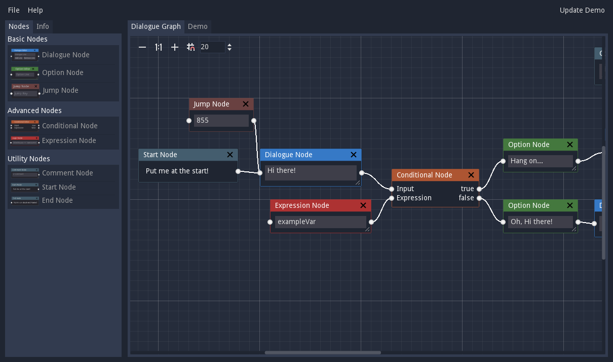
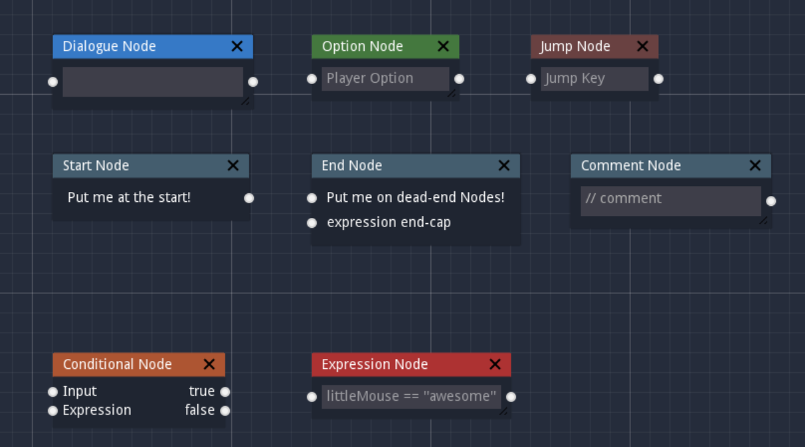
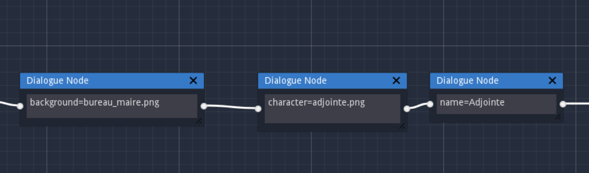
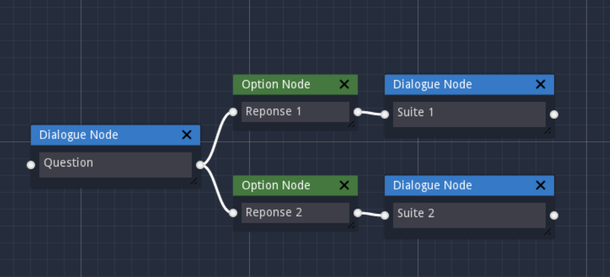
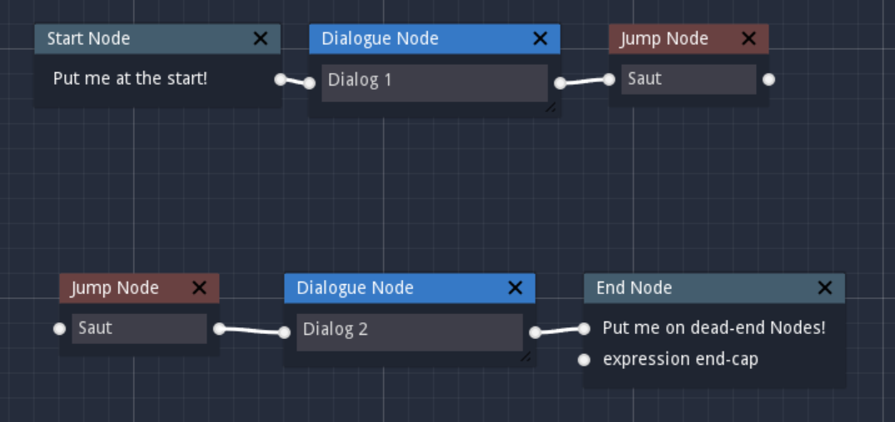
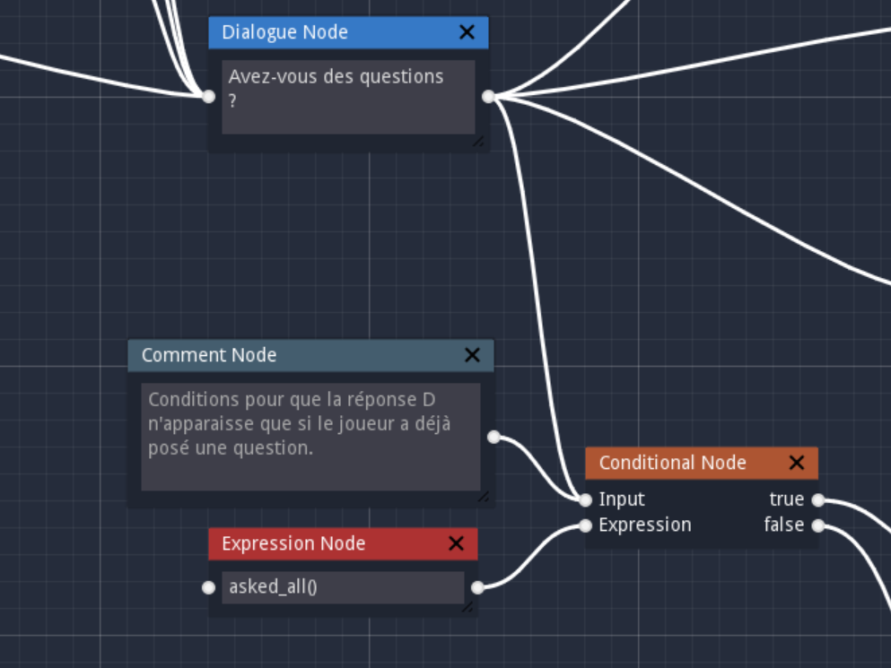
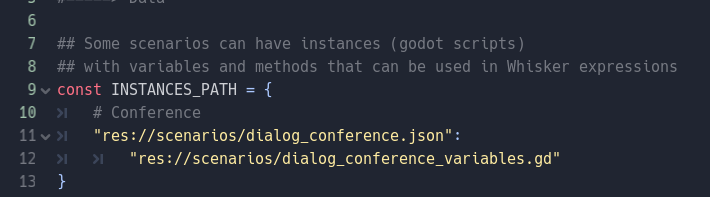
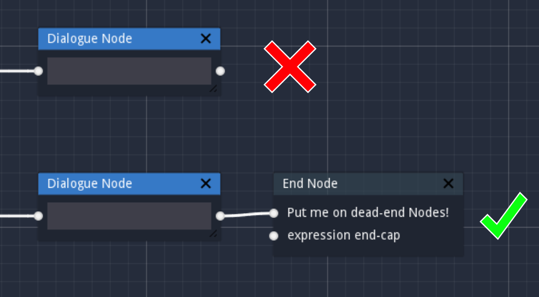

[Retourner au Sommaire]: ../README.md

[Retourner au Sommaire]

### Qu'est-ce que Whiskers

Whiskers est un logiciel open source conçu pour éditer visuellement des dialogues.

Les sources viennent avec quelques exemples qui permettent de comprendre le fonctionnement du logiciel.

Whiskers permet de construire des dialogues grâce à un système de nœuds, formant alors des graphes.

Le code Whiskers peut-être téléchargé depuis Github : https://github.com/LittleMouseGames/whiskers

##### Avoir Whiskers en logiciel

Pour avoir Whiskers sous forme d'un logiciel, la méthode la plus simple est de télécharger ses sources depuis Github et de les exporter avec Godot sous le format voulu.

### Les noeuds Whiskers

#### Dialog Nodes
Les Dialogue Nodes contiennent les principales lignes de dialogues. Chaque nouvelle bulle contient une nouvelle réplique.

##### Paramètres des dialogues
Dans le Serious Game sur l’Open Data, les Dialog Nodes servent aussi à décrire des informations sur le dialogue, comme par exemple le fond à afficher.

Il ne peut y avoir qu'une seule information par noeud.

Actuellement, il est possible de choisir :
-	L’image de fond : background=fichier_image (l’image doit être dans le dossier assets/sprites/backgrounds)
-	Le personnage à afficher : character=fichier_image, avec l’image dans le dossier assets/sprites/characters
- Le nom à afficher : name=Nom
- Les points à donner à la fin de la branche de dialogue : datapoints=10
- Les bâtiments à donner à la fin de la branche de dialogue : building=Nom Bâtiment
- Si le dialogue doit apparaître de nouveau (il ne sera pas sauvegardé dans le profil du joueur cette fois) : redo=true

Les noms des bâtiments sont les noms donnés aux tuiles du tileset (voir [Ajouter un Bâtiment]).

[Ajouter un Bâtiment]: /serious-game.md#ajouter-un-bâtiment

Pour voir comment utiliser ces noeuds, le plus simple est d'ouvrir un des dialogues déjà existant.

#### Option Nodes

Les Option Nodes permettent de donner les choix de réponses possibles pour le joueur.

#### Jump Nodes

Les Jump Nodes permettent de faire des sauts dans le graphe.

Quand le dialogue atteint l’un des Jump Node, il retournera au premier qui possède le même nom.
Pour éviter les conflits, il est déconseillé de donner le même nom à deux Jump Node destinataires.

#### Nœuds utilitaires
Chaque graphe a un *Start Node*, qui indique le début du dialogue.
Les *End Nodes* servent à indiquer la fin des branches.

Les *Comment Nodes* sont utilisés pour commenter le graphe.

##### /!\\ *Attention* /!\\

Lors de la sauvegarde, toutes les branches qui ne terminent pas par un *End Node* risquent d'être supprimées.

#### Nœuds Logiques

Les deux autres types de nœuds, *Conditional Nodes* et *Expression Nodes*, sont utilisés pour ajouter de la logique au graphe.

L'évènement *scenarios/dialog_conference.json* (qui contient le dialogue de la conférence) y fait appel.

Les *Expression Node* contiennent une expression Godot, qui peut être interprété à l'éxécution. On peut ainsi appeler des méthodes par exemple. Ils utilisent un script externe, codé en GDScript, pour déclarer les fonctions et les variables.

[Lien vers le script pour la conférence].

[Lien vers le script pour la conférence]: ../scenarios/dialog_conference_variables.gd

Les *Conditional Nodes* prennent en entrée ces expressions et vérifient leur valeur, avant de choisir la branche de sortie.
Là encore, les deux branches de sorties doivent être reliées à un autre nœud, ou à un *End Node*.

Dans le Serious Game Open Data, il faut déclarer le lien vers le script dans le fichier *scenarios/scenarios_data.gd*.

### Exportation

Une fois le graphe construit, il peut être sauvegardé sous forme d’un fichier au format JSON. Ce fichier contient toute les informations du graphe et peut être ouvert par Whiskers pour ajouter des modifications.

C’est ce fichier JSON qui est utilisé par la scène *DialogScene* pour afficher les dialogues et les réponses.

### Parcours du graphe

Pour parcourir les fichiers, il faut utiliser un parser capable de parcourir le graphe contenu dans le fichier JSON.

Le Serious Game sur l’Open Data utilise un parser pour Whiskers développé par un membre de la communauté Godot, accessible ici : https://github.com/LittleMouseGames/whiskers-parser.

Les dialogues sont aussi analysés dans le script de *DialogScene* lors de leur affichage, pour vérifier s’ils contiennent des données ou si ils ne sont qu'une ligne de dialogue habituelle.

### Notes importantes

##### En développement
Whiskers est en développement et contient donc sûrement des bugs, comme le souligne son auteur. Néanmoins, aucun souci n’a été constaté lors de son utilisation pendant le stage.

##### Connecter la fin de tous les noeuds
Il est important de toujours connecter la fin des nœuds. Si aucun nœud de dialogue ne les suit, il faut alors les connecter à un *End Node*.

Si certains nœuds ne sont pas connectés, des problèmes peuvent survenir lors de l’exportation ou du parcours du graphe. Il est même possible de perdre les changements en cours ou d'avoir des problèmes à l'ouverture.

